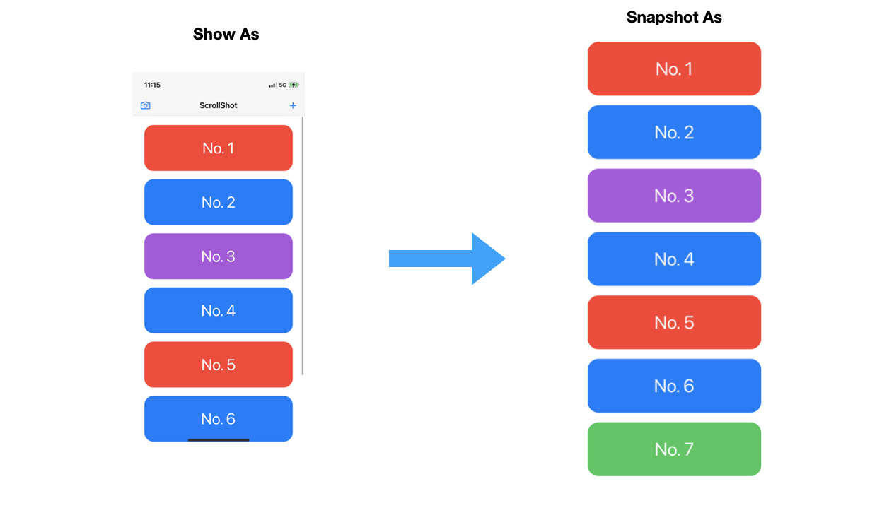

# ScrollShot

## Discussion

It's not hard to snapshot the content with `VStack`, since it's height equal to content's height. But for some containers like `List`, it will take up the whole parent view space and don't care about the content. So if we use same strategy the content will be corp to screen size. One possible way to solve this is add up every height of child view but it's too complex.
